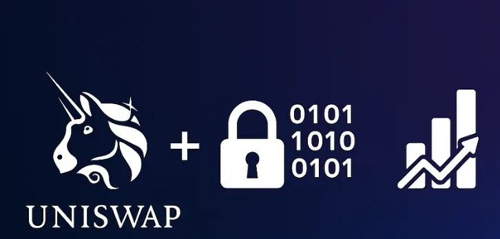

# Zama Compliance Hook for Uniswap v4



## 🌟 Vision

Imagine being able to trade gold, stocks, or real estate directly from your crypto wallet — 24/7 — without compromising privacy or jumping through regulatory hoops.

**Uniswap for the real world assets**: With Uniswap v4 Hooks and Homomorphic Encryption, this vision is becoming reality.

## 🎯 Goal

Enable decentralized, on-chain trading of Real World Assets (RWAs) — like gold, stocks, funds, and real estate — using Uniswap v4 Hooks while preserving user privacy through cryptographic compliance verification.

## 🌍 Why RWAs on Chain?

Bringing real-world assets onto the blockchain offers several practical benefits:

- **Continuous Trading**: Markets operate 24/7 without holidays or trading hours, with everything managed on-chain.
- **Easier Access to Advanced Financial Products**: More people can access advanced financial tools currently limited to certain investors.
- **Improved Settlement**: Transactions settle faster compared to traditional systems.
- **Lower Barriers to Entry**: The minimum investment needed for certain assets is reduced through tokenization.


## 🔐 Smart Contracts Design

Our architecture follows a modular approach with clear separation of concerns, enabling flexible compliance management for RWA trading.

```
┌───────────────┐     ┌───────────────┐     ┌───────────────┐
│  User Registry│────▶│  Rules Engine │◀─── │    Product    │
└───────┬───────┘     └───────────────┘     └───────┬───────┘
        │                     ▲                     │
        │                     │                     │
        │             ┌───────┴───────┐             │
        └────────────▶│     Rules     │◀────────────┘
                      └───────────────┘
                              ▲
                              │
                      ┌───────┴───────┐
                      │   Conditions  │
                      └───────────────┘
```
### User Registry
A smart contract that handles dynamic key-value storage with roles, using a Hierarchical Mapping Pattern combined with Role-Based Access Control.

### Condition
Implemented as a linked list data structure where each condition points to another until forming a complete rule. Each condition represents a single compliance check.

### Rule
A smart contract that contains all conditions needed to validate a specific compliance requirement.

### Rule Factory Contract
A contract that creates and manages rules, ensuring they follow a consistent interface.

### Product
A smart contract that contains all rules required to validate a product for trading.

### Product Shares
ERC20 tokens representing the tokenized shares of the real-world asset.

### Rules Engine
A contract that checks the user registry against the product rules to determine if a user is allowed to trade.


## 🛠️ Technologies Used

- **Uniswap Hook**: A system that allows developers to customize and extend the behavior of liquidity pools in Uniswap v4.
- **Foundry**: Use foundry for develop, test and deploy solidity smart contracts.
- **Fully Homomorphic Encryption (FHE)**: Allows computations on encrypted data without decryption, preserving privacy while enabling verification.

## 📊 How It Works

1. Trader submits a swap request (e.g., USDC → Gold).
2. Uniswap Hook is triggered before execution.
3. Hook queries the Compliance Store using the trader's wallet address.
4. The compliance store checks if the wallet exists and verifies that the profile is encrypted.
5. Verifier checks the trader's jurisdiction, license, order size, and timestamp.
6. If all checks pass, the Hook grants swap permission.

## 🔍 Onboarding Process

1. A licensed expert handles KYC, AML, and jurisdictional checks.
2. Data remains on the client side only.
3. The expert submits encrypted, FHE-compliant data to the Compliance Store smart contract.
4. When a user attempts a trade, their encrypted profile is checked for eligibility based on:
   - Asset type
   - Regulatory limits
   - Time constraints


## 🚀 Roadmap

- **Phase 1**: Design and architecture (Current)
- **Phase 2**: Smart contract implementation
- **Phase 3**: Off-chain verifier development
- **Phase 4**: Integration with Uniswap v4
- **Phase 5**: Testing and deployment

## 🤝 Contributing

If you're exploring similar problems or working on RWA infrastructure, let's connect — we're always open to collaborating or discussing ideas.

## 📚 Further Reading

[Trading Real World Assets In Uniswap With Homomorphic Encryption](https://medium.com/coinmonks/trading-real-world-assets-on-uniswap-with-homomorphic-encryption-51c67dd9d318)

## 📝 License

[MIT](LICENSE)
